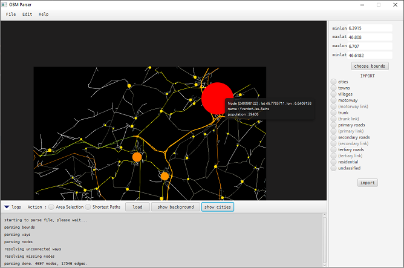

# OSM Parser - Graph builder



## Overview

OSM Parser is a Java application that aims to allow the user to parse data from OpenStreetMap ([https://www.openstreetmap.org/]()), in particular the roads and cities and turn them into a graph, perform opertions on it such as computing shortest paths, and export it as a CSV file, PNG or EPS image. The GUI uses the JavaFX library and *osmosis* to filter data from large .pbf files, (You can find them [here](https://download.geofabrik.de/)). Osmosis is a command line tool that let you keep nodes or ways with specific tags, reject other with other tags, choose elements according to desired specifications, fetch elements from a database,..

The documentation and source code for osmosis can be found here :
* github [source code](https://github.com/openstreetmap/osmosis).
* wiki [detailed specifications](https://wiki.openstreetmap.org/wiki/Osmosis/Detailed_Usage_0.48).

## Status

Work still in progress. Please report all bugs.

## Installation

```bash
git clone https://github.com/sjaubain/OSM-Parser.git
```

### Requirements
* Java set up on your machine
* Osmosis installed (follow instruction in official site)

Since JavaFX components don't come with Java development kit after version 8, it is strongly recommended to use version 8. If you are using a later version, you can temporarily downgrade it to 1.8. Otherwise, you will have to install JavaFX separately and set up your environment correctly.

* **Windows and Mac**

As mentioned above, you can install the JDK 8 if you don't still have it. You may have to set the environment variable. Please refer for example to [this site](https://www.java.com/en/download/help/windows_manual_download.html) for more details. Once installed, type `java -version` to check that everything is correct. You should be able to launch the application by simply click on the .jar file.

* **Ubuntu**

With the linux based OSs, it is a little more tricky to set up javaFX, but there is a script called *linux_setup.sh* that install automatically all required tools. Just type
```bash
sudo bash linux_setup.sh
```
To run the application, type

```bash
sudo bash linux_launcher.
```
If you get errors, try to check if the correct version of JDK is used on your machine with `java -version`. If two or more JDKs are installed you can choose which one you want to use with

```bash
sudo update-alternatives --config java
```
and same for javac, the java compiler. Try to rerun the script and this should be ok.
